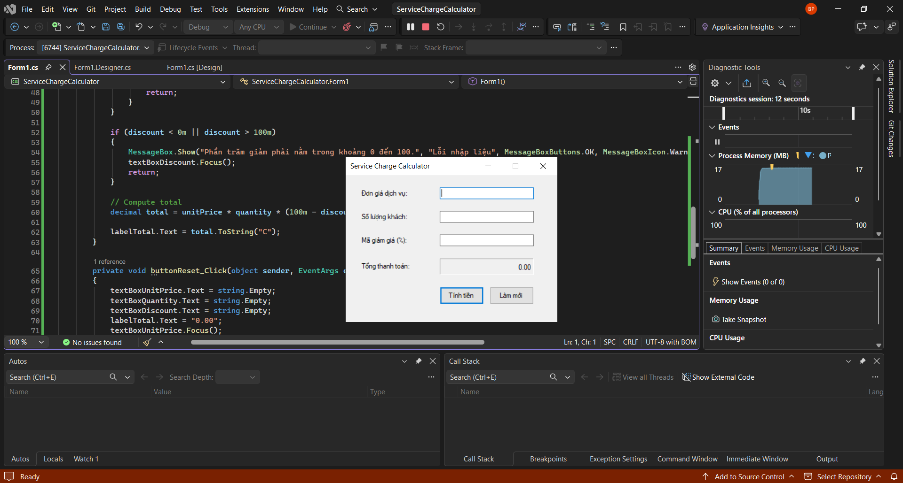
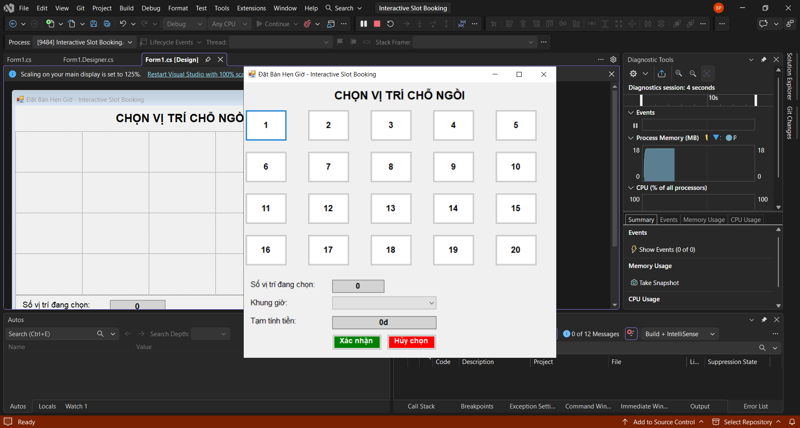
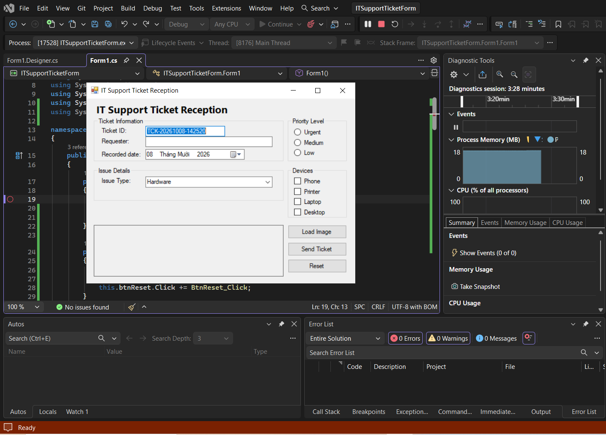

# BÁO CÁO BÀI TẬP / ĐỒ ÁN

## THÔNG TIN SINH VIÊN
- **Họ và tên:** Phạm Gia Bảo
- **Mã số sinh viên:** 24810320309
- **Lớp:** D19QTANM1
- **Tên môn học:** Lập trình C# / Windows Forms
- **Tên bài tập:** Ôn tập Windows Forms

---

## KẾT QUẢ THỰC HÀNH

### 1. Ảnh màn hình Giao diện chính

### 2. Ảnh màn hình Chức năng thực thi / Kết quả

### 3. Ảnh màn hình Kiểm tra lỗi (Validation)

---

## DANH SÁCH BÀI TẬP ÔN TẬP
1. **ServiceChargeCalculator**: Máy tính tính cước dịch vụ & giảm giá.
2. **ITSupportTicketForm**: Form tiếp nhận yêu cầu hỗ trợ IT & kiểm tra thông tin.
3. **ItemListManager**: Quản lý danh sách sản phẩm/mặt hàng.
4. **DeliveryOrderDashboard**: Bảng điều khiển quản lý đơn hàng giao vận.
5. **Interactive Slot Booking**: Ứng dụng đặt chỗ tương tác.
